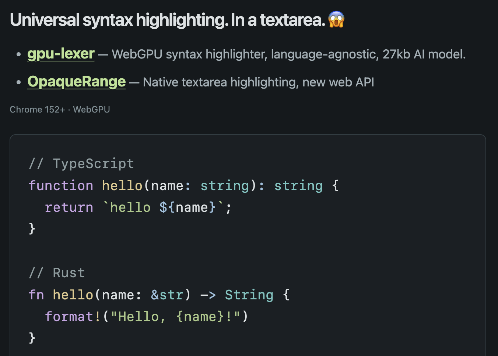

# Syntax highlighting in a textarea

A demo of live syntax highlighting inside a plain HTML `<textarea>`. Start with an empty input, type or paste code in any language, and watch it get colored.

[Demo Playground](https://github.com/slorber/gpu-lexer-textarea)

---



## The idea

- **[gpu-lexer](https://x.com/shuding/status/2097348783415939541)** uses a small AI model running on WebGPU to identify syntax, without selecting a language or loading a grammar.
- **[OpaqueRange](https://olliewilliams.xyz/blog/opaquerange/)** lets us target text inside the textarea. The CSS Custom Highlight API then colors those ranges directly.

The lexer runs in a Web Worker, and existing highlights stay visible while you type. Editing, selection, scrolling, and undo are handled by the browser—no editor library or mirrored text overlay needed.

Everything runs locally in your browser. Highlighting is experimental and may occasionally assign the wrong color.

## Run

Requires Node.js 22.12+, pnpm, and **Chrome 152+ with WebGPU**.

```sh
pnpm install
pnpm start
```

Open the localhost URL printed in the terminal.

## Build and deploy

```sh
pnpm build
```

Deploy the contents of `dist/` to any **HTTPS static host**. No backend or API keys required. Run `pnpm preview` to preview the build locally.

## Tests

```sh
pnpm test
```

Runs browser tests using installed Google Chrome with WebGPU.
